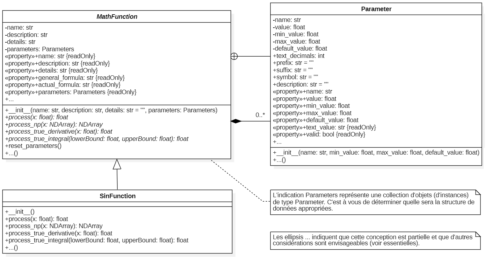

# 420-SF3 Projet 1

## Logiciel d'exploration de méthodes numériques

#### Table des matières
- [I. Introduction](#i-introduction)
- [II. Objectifs spécifiques du projet](#ii-objectifs-spécifiques-du-projet)
- [III. Spécifications techniques](#iii-spécifications-techniques)
- [IV. Contraintes](#iv-contraintes)
- [V. Rapport final](#v-rapport-final)
- [VI. Grille d'évaluation](#vi-grille-dévaluation)
- [VII. Références](#vii-références)

## I. Introduction
Ce projet consiste à développer une application informatique interactive visant la manipulation de méthodes numériques. Le logiciel permettra à l'usager d'explorer ces méthodes à l'aide d'un outil interactif qui permettra de mieux comprendre leur fonctionnement.

Ce projet est le premier du cours 420-SF3 et vaut pour 25% de la note finale du cours. Il constitue aussi la base de connaissance du premier examen. 

L'objectif principal de ce projet est de mettre en pratique les notions vues en classe depuis le début de votre DEC. Il ne suffit pas de produire un logiciel fonctionnel, mais aussi de démontrer une bonne maîtrise des concepts de programmation enseignés.

[↩️](#home)

## II. Objectifs spécifiques du projet

On divise les objectifs du projet en deux catégories : les objectifs de qualités et les objectifs fonctionnels. Dans les deux cas, on vise à ce que l'étudiant profite du projet pour mettre en pratique ces notions.

### A. Objectifs de qualité

Il est important de comprendre que la note finale sera attribuée en considérant les aspects suivants :
- structure de **code** adaptée et **modulaire** (_DRY_),
- qualité de la programmation **orientée objet** (abstraction, encapsulation, héritage, polymorphisme),
- utilisation pertinente des **structures de données** (choix adapté et analyse de la complexité pour justifier vos choix),
- utilisation juste de la bibliothèques de calcul numérique **`NumPy`** (utilisation intelligente du `ndarray` et vectorisation lorsque possible),
- utilisation de bibliothèques graphiques Qt **`PySide6`** (modularité, composition, signaux et slots, ...),
- **qualité** générale du code : lisibilité, autodocumentation, commentaires, documentation, citation de ses sources, ...

### B. Objectifs fonctionnels

Les objectifs fonctionnels du projet sont les suivants :
1. Le logiciel doit offrir une interface utilisateur intuitive et interactive autant que possible.
1. Le logiciel se divise en trois parties principales : 
   - une section de sélection de configuration de la fonction mathématique (la fonction et ses paramètres),
   - une section exploratoire des techniques numériques demandées (sélection de la méthode et de ses paramètres),
   - un graphique affichant toutes les informations pertinentes de l'exploration en cours.
1. Au moins deux méthodes d'analyse numérique doivent être implémentées :
    - dérivation numérique
    - intégrale définie numérique
1. L'interactivité du graphique est un atout important, mais pas obligatoire. Il est recommandé de débuter le projet en provoquant la mise à jour du graphique via un bouton et progressivement vers des interactions en temps réel.

[↩️](#home)

## III. Spécifications techniques

Les spécifications techniques du projet sont les suivantes :

- On désire un logiciel de bureau (_desktop application_).
- Pour chaque technique d'analyse numérique, trois sections sont requises :
    1. un panneau de sélection de la fonction mathématique à analyser et de ses paramètres,
    1. un panneau de configuration des paramètres de la méthode,
    1. un graphique interactif affichant la fonction mathématique et les résultats de la méthode.

### Panneau de sélection de la fonction mathématique

Le panneau de sélection de la fonction mathématique doit permettre à l'utilisateur de choisir la fonction à analyser ainsi que ses paramètres. Il doit inclure :

- Un menu déroulant pour sélectionner la fonction mathématique (par exemple, polynôme, sinusoïdale, exponentielle, somme de fonctions trigonométriques, ...).
- Des champs de saisie pour chacun des paramètres de la fonction. Chaque paramètre doit avoir :
    - un nom (par exemple, amplitude, fréquence, phase, décalage vertical, ...),
    - une valeur minimale, maximale et par défaut,
    - sa valeur actuelle modifiable par l'utilisateur,
    - une description courte affichée en info-bulle,
    - des instructions de formattage comme la précision, un préfixe ou un suffixe.
- Un bouton permettant de réinitialiser les paramètres à leur valeur par défaut.
- Un bouton permettant d'afficher une description de la fonction sélectionnée par une boîte de dialogue.

Vous devez offrir au moins 3 fonctions mathématiques différentes qui ont des paramètres modifiables. Une de ces fonctions est imposée et les deux dernières sont laissées à votre choix :
1. La fonction sinusoïdale générale est imposée
    - $f(x) = a \cdot \sin(f \cdot x + p) + o$
    - avec ces 4 paramètres modifiables :

        | Symbole | Nom | Description | Valeur minimum | Valeur maximum | Valeur par défaut |
        | :---: | :--- | :--- | :---: | :---: | :---: |
        | $a$ | Amplitude | Facteur d'échelle vertical | -5.0 | 5.0 | 1.0 |
        | $f$ | Fréquence | Facteur d'échelle horizontal | -5.0 | 5.0 | 1.0 |
        | $p$ | Phase | Décalage horizontal | $-2\pi$ | $+2\pi$ | 0.0 |
        | $o$ | Décalage vertical | Décalage vertical | -5.0 | 5.0 | 0.0 |

1. Les deux autres fonctions sont à votre choix mais doivent respecter ces contraintes :
    - elles doivent avoir au moins deux paramètres modifiables,
    - les valeurs par défaut des parameètres doivent présenter une situation intéressante de la fonction,
    - chacune des 3 fonctions doit être structuellement différente des autres.
1. Par exemple, un polynôme de degré $n$
    - avec la forme $f(x) = \displaystyle \sum_{i=0}^{n} c_i \cdot x^i$
    - avec $n + 1$ paramètres modifiables, les coefficients $c_i$.

D'un point de vue plus technique, on s'attend au minimum à :
- une classe abstraite `MathFunction` définissant toutes les caractéristiques communes aux fonctions mathématiques,
- des classes concrètes dérivant de `MathFunction` pour chaque fonction mathématique (dont `SinFunction`),
- un panneau autonome `QMathFunctionPanel` héritant de `QWidget` permettant de :
    - sélectionner la fonction et de modifier ses paramètres,
    - émettre un signal `mathFunctionChanged` lorsque la fonction a changée,
    - émettre un signal `parameterChanged` lorsque l'un des paramètres change
- même si ce n'est pas obligatoire, plusieurs autres classes peuvent être créées pour modulariser et simplifier le développement. 

Le diagramme de classe UML suivant illustre une conception possible pour la gestion des fonctions mathématiques. 

  

### Panneau de configuration des paramètres de la méthode de dérivation numérique

On utilise la méthode des différences finies pour la dérivation numérique (voir le document [RappelDerivationNumerique](../ref/RappelDerivationNumerique.md)). Le panneau de configuration doit inclure ces éléments :
- les intrants :
    - $P$, le point d'évaluation de la dérivée a l'abcisse $x$: $P = (x, f(x))$.
    - $h$, le pas de la méthode
    - $\alpha$, le paramètre de positionnement relatif de l'intervalle d'évaluation autour de $P$
    - trois boutons permettant de déterminer rapidement la valeur de $\alpha$ :
        - `Gauche` : $\alpha = 0.0$
        - `Milieu` : $\alpha = 0.5$
        - `Droit` : $\alpha = 1.0$
    - $r$, l'étendue de la partie visible de la courbe autour de $P$ (le graphique affiche la fonction entre $x - r$ et $x + r$) - ce paramètre ne sert pas au calcul de la dérivée, mais uniquement pour l'affichage.
    - un bouton permet de réinitialiser les paramètres à leur valeur par défaut.
    - un bouton permet d'afficher une description de la méthode par une boîte de dialogue.
- les extrants :
    - $D_{\text{num}}$, la valeur de la dérivée numérique à $P$
    - $D_{\text{vrai}}$, la valeur de la dérivée analytique à $P$
    - $E_a$, l'erreur absolue: $E_a = |D_{\text{num}} - D_{\text{vrai}}|$
    - $E_r$, l'erreur relative: $E_r = \displaystyle \frac{E_a}{|D_{\text{vrai}}|}$

D'un point de vue plus technique, on s'attend minimalement à :
- une classe `NumericalDifferentiation` implémentant toute la logique mathématique de dérivation numérique
    - cette classe possède une dépendance envers la classe `MathFunction` pour évaluer la fonction mathématique
    - cette classe _peut_ utiliser `NumPy` pour réaliser les calculs numériques si nécessaire
    - cette classe est entièrement indépendante de `PySide6` et de l'interface utilisateur
- un panneau autonome `QNumericalDifferentiationPanel` héritant de `QWidget` permettant de :
    - modifier les paramètres de la méthode,
    - émettre un signal `parameterChanged` lorsque l'un des paramètres de la méthode change,

### Panneau de configuration des paramètres de la méthode d'intégration finie numérique

On utilise la méthode des différences finies pour l'intégration numérique (voir le document [RappelInegrationNumerique](../ref/RappelInegrationNumerique.md)). Le panneau de configuration doit inclure ces éléments :
- les intrants :
    - $a$ et $b$, les bornes d'intégration (attention on veut garantir que $a < b$)
    - $n$, le nombre de divisions de l'intervalle $[a, b]$
    - deux méthodes d'intégration sélectionnables par l'utilisateur :
        - la méthode des rectangles
        - la méthode des trapèzes
    - seulement pour la méthode des rectangles, $\alpha$, le paramètre de positionnement relatif de l'intervalle d'évaluation autour de $P$
    - trois boutons permettant de déterminer rapidement la valeur de $\alpha$ :
        - `Gauche` : $\alpha = 0.0$
        - `Milieu` : $\alpha = 0.5$
        - `Droit` : $\alpha = 1.0$
    - un bouton permet de réinitialiser les paramètres par défaut.
    - un bouton permet d'afficher une description de la méthode par une boîte de dialogue.
- les extrants :
    - $I_{\text{num}}$, la valeur de l'intégrale numérique entre $a$ et $b$
    - $I_{\text{vrai}}$, la valeur de l'intégrale analytique entre $a$ et $b$
    - $E_a$, l'erreur absolue: $E_a = |I_{\text{num}} - I_{\text{vrai}}|$
    - $E_r$, l'erreur relative: $E_r = \displaystyle \frac{E_a}{|I_{\text{vrai}}|}$

D'un point de vue plus technique, on s'attend minimalement à :
- une classe `NumericalIntegration` implémentant toute la logique mathématique d'intégration numérique
    - cette classe possède une dépendance envers la classe `MathFunction` pour évaluer la fonction mathématique
    - cette classe est entièrement indépendante de `PySide6` et de l'interface utilisateur
    - cette classe **doit** utiliser `NumPy` pour réaliser les calculs numériques si nécessaire
- un panneau autonome `QNumericalIntegrationPanel` héritant de `QWidget` permettant de :
    - modifier les paramètres de la méthode,
    - émettre un signal `parameterChanged` lorsque l'un des paramètres de la méthode change.

### Graphique interactif

Voici les exigences pour le graphique interactif :
- la fonction mathématique sélectionnée considérant sa configuration courante
- selon la méthode numérique en cours, le graphique doit afficher les éléments suivants :
    - Pour la dérivation numérique :
        - la tangente à la courbe au point d'évaluation
        - la droite passant par les deux points utilisés pour calculer la dérivée
        - des marqueurs indiquant les points utilisés pour le calcul de la dérivée
    - Pour l'intégration numérique avec la méthode des rectangles :
        - la fonction mathématique
        - les rectangles utilisés pour l'approximation de l'intégrale
        - une annotation indiquant la valeur approximative de l'intégrale
    - Pour l'intégration numérique avec la méthode des trapèzes :
        - la fonction mathématique
        - les trapèzes utilisés pour l'approximation de l'intégrale
        - une annotation indiquant la valeur approximative de l'intégrale

### Résumé des exigences

| Exigence | Minimum requis |
| :--- | :--- |
| Nombre de fonctions mathématiques | 3 |
| Nombre de méthodes numériques | 2 |
| Méthodes numériques | Dérivation numérique, Intégration numérique |
| Méthodes d'intégration numérique | Rectangles, Trapèzes |
| Langage de programmation | Python |
| Bibliothèques | PySide6, NumPy |
| Interface utilisateur | Application de bureau (desktop application) |

[↩️](#home)

## IV. Contraintes 

On divise les contraintes en deux catégories : les contraintes techniques et les contraintes de gestion de projet.

### A. Contraintes techniques

- Les technologies à utiliser sont :
    - `Python`
    - `PySide6`
    - `NumPy`
    - `Visual Studio Code`
    - Dans tous les cas, on utilisera les versions correspondantes aux environnements de l'école.
- Les documents de conception suivants sont attendus :
    - vous devez faire une maquette relativement détaillée de votre interface utilisateur
    - vous devez produire un diagramme de classes UML présentant toutes les classes nécessaires au modèle, principalement : 
        - les fonctions mathématiques
        - les méthodes de résolution numérique
        - **important**:
            - il est attendu que vous produisiez ces documents avant de commencer le développement
            - ces documents ne doivent pas être parfaits et peuvent évoluer au cours du développement
            - ces documents doivent être produits en équipe et validés par tous les membres avant de commencer
            - il ne faut pas faire les classes de l'interface utilisateur
- Le code doit être écrit en respectant les conventions :
    - guide de style [PEP 8](https://www.python.org/dev/peps/pep-0008/)
    - docstring [PEP 257](https://www.python.org/dev/peps/pep-0257/)
    - annotation de types [PEP 484](https://www.python.org/dev/peps/pep-0484/)
- L'utilisation des conventions et des bonnes pratiques liées au masquage (contraintes d'accès) est obliggatoire :
    - la visibilité des attributs et des méthodes doit être correctement définie selon les conventions établies :
        - public : aucun préfixe 
        - protégé : mot préfixé par un soulignement `_`
        - privé : mot préfixé par deux soulignements `__` (attention au _name mangling_)
    - l'utilisation des propriétés est obligatoire avec `@property` (vous devez déterminer quand créer un accesseur et quand produire un mutateur).
- Pour la docstring : 
    - vous devez documenter `docstring` au moins les classes issus de votre conception UML
    - vous pouvez utiliser l'intelligence artificielle pour la rédiger, mais vous devez la relire pour la valider et citer cette génération automatique (citation à même la `docstring`).
- Avec `PySide6` :
    - l'interface utilisateur doit être conçue en code (pas de `.ui` généré par Qt Designer)
    - l'interface utilisateur doit être modulaire et réutilisable (création de widgets personnalisés composés de widgets)
    - l'interface utilisateur doit utiliser les signaux et slots pour la communication entre les composants
    - l'interface utilisateur doit être _responsive_ (utilisation pertinente des _layouts_ en ne fixant pas de tailles absolues sauf pour quelques cas particuliers)
    - vous devez utiliser `snake_case` et `true_property` pour rendre l'API plus _pythonic_ (voir le document `info_pyside6.md` dans le dossier `doc`).
- Pour `NumPy` :
    - vous devez utiliser `ndarray` pour les calculs numériques
    - vous devez éviter les boucles `for` lorsque possible en utilisant la vectorisation
- Graphique :
    - Vous pouvez produire un graphique par dessin personnnalisé avec `QPainter` ou utiliser une bibliothèque de graphique `QtCharts`. 
    - Chaque approche possède ses avantages et ses inconvénients. Néanmoins, l'utilisation de `QtCharts` est recommandée pour ce projet. C'est un apprentissage important et il y aura d'autres opportunités pour produire des graphiques personnalisés.
- Produit final
    - L'enseignant vous présentera un exemple de logiciel fonctionnel pour le projet. 
    - Toutefois, gardez en tête que ce n'est qu'un exemple. 
    - Autrement dit, vous avez pleine liberté pour produire la forme du logiciel qui vous inspire, en autant que vous répondiez aux exigences fonctionnelles et techniques du projet.

- Widgets donné pour démarrer le projet :
    - _à venir..._
- Langue d'usage :
    - vous pouvez utiliser le français ou l'anglais pour le code à condition de rester uniforme pour tout le projet
        - les noms de variables, fonctions, classes, etc.
        - la docstring
    - les commentaires du code peuvent être en français ou en anglais à votre convenance
    - l'interface utilisateur **doit** être en français
- Le logiciel ne doit pas _planter_ dans des conditions normales d'utilisation. Vous devez gérer les erreurs et les exceptions de manière appropriée. On mettra une emphase sur ces aspects :
    - validation des intrants utilisateur
    - gestion des erreurs de calcul (division par zéro, racine carrée de nombre négatif, logarithme de nombre négatif, ...)
    - messages d'erreur clairs et informatifs pour l'utilisateur
- Il n'est pas obligatoire que le graphique soit interactif et suit toutes les modifications en temps réel. Il est recommandé de débuter le projet en provoquant la mise à jour du graphique via un bouton.

### B. Contraintes de gestion de projet

- Projet d'équipe :
    - le projet doit être réalisé en équipe de quatre étudiants. 
    - chaque étudiant doit contribuer de manière significative au projet. 
    - un fichier d'autoévaluation est à remplir par l'équipe à la fin du projet (cette évaluation sera prise en compte dans la note finale en pondérant l'implication de chacun).
    - la programmation en binôme (_pair programming_) doit être au premier plan (voir le document [ProgrammationBinome](../ref/ProgrammationBinome.md)).
    - chaque équipe possède deux sous-équipes de deux personnes.
    - la permutation des membres des sous-équipes doit être fréquente (maximum 1 heure entre chaque permutation).
- Étapes de développement recommandées :
    - **Planification** : 
        - assurez-vous de bien comprendre le projet, ses objectifs et les fonctionnalités attendues.
        - il est important de bien lire ce document et d'en clarifier le contenu avec vos collègues de travail d'abord et avec l'enseignant ensuite.
        - rédiger un plan de projet avec des jalons et des échéances.
        - diviser les tâches entre les membres de l'équipe en fonction de leurs compétences et intérêts.
    - **Conception** : 
        - produisez une maquette détaillée de l'interface utilisateur,
        - uniquement pour les classes réalisant des analyses numériques, faites-en la conception UML (diagramme de classes),
        - il est important que tous les membres de l'équipe comprennent et approuvent la conception avant de commencer le développement.
    - **Développement** : 
        - en formant des sous-équipes de deux personnes et en répartissant les tâches suivant les divisions faites lors de la planification,
        - coder les fonctionnalités en vous assurant de tester régulièrement votre code,
        - la programmation en binôme (_pair programming_) doit être au premier plan.
- Structure de dossiers et remise du projet :
    - La remise du projet doit inclure tous les fichiers et dossiers nécessaires à son bon fonctionnement.
    - Le projet doit être remis avant la date limite indiquée.
    - Toute forme de plagiat ou de tricherie entraînera des sanctions sévères conformément aux politiques académiques de l'institution. Si vous avez des questions sur ce qui est permis ou non, n'hésitez pas à poser des questions.
    - La remise du projet se fait via Moodle à raison d'une remise par équipe. La remise contient ces éléments:
    - Vous devez organiser votre projet dans une structure de dossiers strictes imposées, référez-vous au document [StructureDossiersProjet](../ref/StructureDossiersProjet.md) pour les détails. La présentation suivante illustre la structure attendue. Le symbole `<<<` indique les documents à produire et à remettre par les étudiants. Vous devez respecter cette structure de travail et laissez présents tous les fichiers donnés initialement. 

        <pre>
        ├── doc
        │   ├── pres
        │   │   ├── 420-SF3 Projet 1.md
        │   │   ├── uml_math_function_prototype.png
        |   |
        │   ├── ref
        │   │   ├── ProgrammationBinome.md
        │   │   ├── RappelInegrationNumerique.md
        │   │   ├── StructureDossiersProjet.md
        │   │   ├── info_pyside6.md
        |   |
        │   ├── final
        │   │   ├── RapportFinal.md                    <<<
        │   │   ├── AutoevaluationEquipe.xlsx          <<<
        │   │   ├── CommentairesEtCoquilles.md         <<< (optionnel)
        │
        ├── des
        │   ├── UML.png                                <<< 
        │   └── UI_Mockup.png                          <<<
        |
        ├── dev
        │   ├── fichiers de code source (.py)
        │   ├── donnés initialement
        │   ├── produits par l'équipe                  <<<
        │   ├── ...
        |
        ├── readme.md                                  <<<

        </pre>

    - Le fichier `readme.md` est un document standard de présentation d'un projet. Il permet de fournir des informations essentielles sur ce dernier, son installation, son utilisation, ses contributeurs, sa documentation et sa licence. Pour ce projet, on vous demande d'inclure au minimum :
        - une présentation sommaire du projet,
        - les technologies utilisées,
        - le nom des auteurs.

[↩️](#home)

## V. Rapport final 

_à venir..._

[↩️](#home)

## VI. Grille d'évaluation 

_à venir..._

[↩️](#home)

## VII. Références

Consultez les documents suivants pour un rappel des notions mathématiques nécessaires à ce projet :
- [RappelDerivationNumerique](../ref/RappelDerivationNumerique.md)
- [RappelInegrationNumerique](../ref/RappelInegrationNumerique.md)

Plus largement, vous pouvez aussi consulter ces ressources en ligne pour vous aider dans le développement :
- Mathématique : Articles Wikipédia :
    - [Dérivée](https://fr.wikipedia.org/wiki/D%C3%A9riv%C3%A9e)
    - [Différences finies](https://fr.wikipedia.org/wiki/Diff%C3%A9rences_finies)
    - [Intégrale définie](https://fr.wikipedia.org/wiki/Int%C3%A9grale_d%C3%A9finie)
    - [Calcul numérique d'une intégrale](https://fr.wikipedia.org/wiki/Calcul_num%C3%A9rique_d%27une_int%C3%A9grale)

- Informatique : Documentation officielle:
    - [Python](https://docs.python.org/3/)
    - [PySide6](https://doc.qt.io/qtforpython/)
    - [NumPy](https://numpy.org/doc/)

[↩️](#home)
